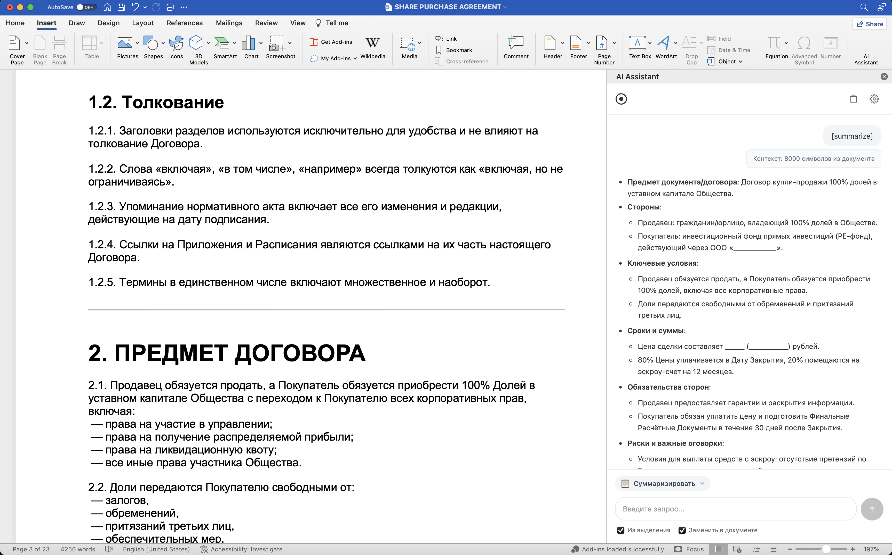

# Word AI Assistant

Task Pane Add-in для Microsoft Word с ChatGPT-интерфейсом для работы с документами.



## Возможности

- **Chat по документу** — задавайте вопросы по содержимому документа
- **Переформулирование** — переписывание выделенного текста с сохранением смысла
- **Сжатие** — сокращение текста до 30-50% от оригинала
- **Расширение** — дополнение текста уточнениями и деталями
- **Суммаризация** — структурированное резюме документа
- **Генерация разделов** — создание новых разделов по описанию

## Требования

- Node.js 18+
- Microsoft Word for Mac (Microsoft 365) или Word Online
- OpenAI API ключ

## Установка

```bash
# Клонируйте репозиторий
cd WordAI

# Установите зависимости
npm install

# Создайте файл .env в папке server
cp server/.env.example server/.env

# Отредактируйте .env и добавьте ваш OpenAI API ключ
```

### Конфигурация (server/.env)

```env
OPENAI_API_KEY=sk-your-api-key-here
OPENAI_API_BASE=https://api.openai.com/v1
LLM_MODEL=gpt-4o-mini
PORT=3001
MAX_CONTEXT_CHARS=8000
```

## Запуск

```bash
# Запуск клиента и сервера одновременно
npm run dev

# Или раздельно:
npm run dev:client  # Фронтенд на https://localhost:3000
npm run dev:server  # Бэкенд на http://localhost:3001
```

При первом запуске клиента `vite-plugin-mkcert` автоматически создаст и установит SSL-сертификат для localhost.

## Sideload в Word for Mac

### Способ 1: Через папку ~/Library/Containers (рекомендуется)

1. Закройте Word
2. Скопируйте манифест:
   ```bash
   mkdir -p ~/Library/Containers/com.microsoft.Word/Data/Documents/wef
   cp manifest/word-addin-manifest.xml ~/Library/Containers/com.microsoft.Word/Data/Documents/wef/
   ```
3. Откройте Word
4. Перейдите: **Вставка → Надстройки → Мои надстройки**
5. Найдите "AI Assistant" и активируйте

### Способ 2: Через меню разработчика

1. Откройте Word
2. Перейдите: **Вставка → Надстройки → Мои надстройки**
3. Выберите вкладку **Общая папка** (или **Shared Folder**)
4. Нажмите **Обзор** и выберите файл `manifest/word-addin-manifest.xml`

### Способ 3: Через Office Online

1. Откройте Word Online (office.com)
2. Создайте или откройте документ
3. **Вставка → Надстройки → Управление моими надстройками**
4. **Отправить надстройку** → выберите `word-addin-manifest.xml`

## Использование

1. Откройте документ в Word
2. Нажмите кнопку **AI Assistant** на панели "Вставка"
3. Выберите режим работы в выпадающем списке
4. Введите запрос и нажмите **Отправить**

### Режимы работы

| Режим | Требует выделение | Описание |
|-------|-------------------|----------|
| Chat по документу | Нет | Вопросы по содержимому документа |
| Переформулировать | Да | Переписать выделенный текст |
| Сжать | Да | Сократить текст на 50-70% |
| Расширить | Да | Добавить детали и уточнения |
| Суммаризировать | Нет | Создать структурированное резюме |
| Сгенерировать раздел | Нет | Создать новый раздел по описанию |

### Опции

- **Использовать выделенный текст** — брать контекст из выделения (иначе из всего документа)
- **Заменить выделенный текст** — автоматически заменить выделение на результат

## Настройки

Нажмите ⚙️ в панели для доступа к настройкам:

- **Модель LLM** — модель OpenAI (gpt-4o-mini, gpt-4o, etc.)
- **Максимум символов контекста** — лимит текста для отправки в LLM
- **Юридический стиль** — использовать юридическую терминологию в промптах

## Структура проекта

```
WordAI/
├── manifest/
│   └── word-addin-manifest.xml   # Манифест Office Add-in
├── client/                        # React + Vite + TypeScript
│   ├── src/
│   │   ├── components/           # UI компоненты
│   │   ├── hooks/                # React хуки
│   │   ├── office/               # Office.js обёртки
│   │   ├── api/                  # HTTP клиент
│   │   └── utils/                # Промпты и утилиты
│   └── vite.config.ts
├── server/                        # Express + TypeScript
│   ├── src/
│   │   ├── index.ts              # HTTP сервер
│   │   └── llm.ts                # OpenAI интеграция
│   └── .env                      # Конфигурация (не в git)
├── config/
│   └── config.example.json       # Пример конфигурации
└── package.json
```

## Решение проблем

### Сертификат не доверен

При первом запуске браузер может показать предупреждение о сертификате. Добавьте исключение или:

```bash
# macOS - доверить сертификат
sudo security add-trusted-cert -d -r trustRoot -k /Library/Keychains/System.keychain ~/.vite-plugin-mkcert/cert.pem
```

### Add-in не загружается

1. Убедитесь что dev-сервер запущен (`npm run dev`)
2. Откройте https://localhost:3000 в браузере и примите сертификат
3. Перезапустите Word
4. Проверьте консоль Word на ошибки (Cmd+Option+I в Word Online)

### Ошибка API

1. Проверьте `OPENAI_API_KEY` в `server/.env`
2. Проверьте логи сервера в терминале
3. Убедитесь что модель доступна для вашего API ключа

